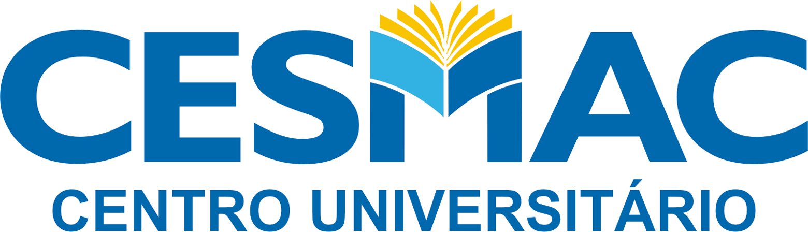

# CronoLab — Cronograma de Laboratórios

> Sistema de gestão de cronogramas e agendamentos para os laboratórios do **Centro Universitário CESMAC**, Maceió — AL.


<p align="center">
  
</p>

<p align="center">
  <a href="#sobre">Sobre</a> •
  <a href="#perfis-de-acesso">Perfis de Acesso</a> •
  <a href="#funcionalidades">Funcionalidades</a> •
  <a href="#novidades-recentes">Novidades Recentes</a> •
  <a href="#identidade-visual-cesmac">Identidade Visual</a> •
  <a href="#arquitetura-e-ia">Arquitetura & IA</a> •
  <a href="#tecnologias">Tecnologias</a> •
  <a href="#estrutura-do-projeto">Estrutura do Projeto</a> •
  <a href="#variaveis-de-ambiente">Variáveis de Ambiente</a> •
  <a href="#instalacao">Instalação</a> •
  <a href="#licenca">Licença</a>
</p>

<p align="center">
  
  
  
  
  
  
  
  
</p>

<p align="center">
  <a href="https://cronolab-novo.web.app"><strong>🌐 Ver sistema online →</strong></a>
</p>

---

## Sobre

O **CronoLab** é um sistema web desenvolvido para resolver um problema real do dia a dia dos laboratórios do CESMAC: a gestão manual e descentralizada de agendamentos.

O sistema centraliza o cronograma de todos os laboratórios em uma única plataforma, com perfis distintos para coordenadores, técnicos e alunos. Substitui planilhas e processos manuais por um painel inteligente com verificação automática de conflitos, análise de ocupação e notificações em tempo real.

**Destaques:**
- 🏫 Desenvolvido para uso real no CESMAC — não é um projeto de demonstração
- ⚡ Roda 100% no plano gratuito do Firebase (Spark) — zero custo de infraestrutura
- 📱 Responsivo, instalável como PWA (Android/iOS/Desktop) e com notificações push
- 🌙 Dark mode com identidade visual da instituição
- 🤖 Assistente de IA híbrido (motor local + Groq/Llama) para consultas em linguagem natural sobre o cronograma
- 📥 Importação inteligente de cronogramas externos (Excel, CSV, JSON e Word) com reconhecimento automático de colunas
- 🔔 Notificações via Telegram e Web Push (FCM) para alterações no cronograma
- 🛡️ Infraestrutura segura em variáveis de ambiente e código tipado em TypeScript

---

## Perfis de Acesso

O acesso é feito via **Login com Google**. No primeiro login, o cadastro fica com status **Pendente** até que um coordenador aprove o usuário e defina seu cargo. Existem três perfis:

### 👨‍💼 Coordenador
Visão estratégica e administrativa completa do sistema:
- Painel com KPIs (aulas hoje, revisões hoje, total de aulas/revisões do semestre, propostas pendentes, eventos de manutenção)
- Agendar Aula / Agendar Evento diretamente (sem passar pelo fluxo de proposta)
- **Aprovações**: aprovar, rejeitar e designar técnicos para propostas enviadas
- **Usuários**: aprovar novos cadastros, alterar cargos e remover usuários
- **Importar Cronograma Externo**: subir planilhas/documentos de outras fontes e converter em aulas
- **Eventos**: cadastrar períodos acadêmicos (provas, feriados, recessos) e eventos de manutenção/bloqueio de laboratório
- **Gerenciar Avisos**: publicar comunicados (normal, importante, urgente)
- **Análise de Aulas e Eventos**: gráficos de ocupação por laboratório, curso, turno, evolução mensal e taxa de aprovação
- **Verificar Integridade dos Dados**: detecta aulas com dados faltando, conflitos de horário e tipos de atividade inválidos
- Ativa/desativa a visualização do Calendário Acadêmico para os alunos

### 🧑‍🔬 Técnico
Visão operacional do dia a dia do laboratório:
- Onboarding inicial para selecionar os laboratórios monitorados (seleção salva por dispositivo)
- Painel com cronograma oficial filtrado pelos laboratórios favoritos e agenda privada do dia
- **Propor Aula / Propor Atividade**: envia propostas de aula para aprovação do coordenador
- **Minhas Propostas**: acompanha status (pendente, aprovada, rejeitada)
- **Minhas Designações**: lista as aulas em que foi designado como responsável
- **Revisões**: agenda privada (Agenda do Técnico) para revisões de conteúdo, pré-provas, monitorias e preparações de material
- Acesso ao Assistente de IA, Download do Cronograma, Avisos e Ajuda/FAQ

### 🎓 Aluno
Perfil de leitura, liberado pelo coordenador:
- Visualização do Calendário Acadêmico (quando habilitado pela coordenação)
- Consulta ao cronograma público de aulas dos laboratórios

---

## Funcionalidades

### 📅 Cronograma e Agendamento
- Calendário com blocos de horário fixos (07:00–09:10, 09:30–12:00, 13:00–15:10, 15:30–18:00, 18:30–20:10, 20:30–22:00) para padronizar agendamentos e facilitar a visualização de conflitos
- Verificação automática de conflitos de horário por laboratório
- Histórico de Aulas com log de inclusões/exclusões, autor e data (auditoria)
- Grade de disponibilidade por laboratório

### ✅ Fluxo de Propostas e Aprovações
- Técnicos propõem aulas/eventos; coordenadores aprovam, rejeitam ou designam responsáveis
- Designação de múltiplos técnicos por aula (`DesignarTecnicosModal`)
- Contador de propostas pendentes em tempo real no menu do coordenador

### 📥 Importação Inteligente de Cronogramas
- Upload de cronogramas externos em **Excel, CSV, JSON e Word (.docx)**
- Reconhecimento automático de colunas, datas, cursos, disciplinas, docentes e turnos, com preenchimento a partir dos metadados do documento
- Revisão dos itens importados antes da confirmação, com indicação visual dos resultados

### 🤖 Assistente de IA
- Motor híbrido: regras locais estruturadas (classificação de intenção, extração de parâmetros e execução de ações) combinadas com a API Groq (`llama-3.3-70b-versatile`) para linguagem natural
- Consultas como "quais aulas tenho hoje no Lab de Informática?" ou análises agregadas de ocupação
- Versões dedicadas para o perfil técnico e para consultas administrativas

### 🔔 Avisos e Notificações
- Mural de Avisos com três níveis (normal, importante, urgente) e controle de leitura por usuário
- Notificações Push Web via Firebase Cloud Messaging, com Service Worker (`firebase-messaging-sw.js`) capaz de notificar mesmo com o navegador fechado
- Notificações via **Bot do Telegram** quando uma aula é criada, editada ou excluída

### 📊 Análises e Integridade de Dados
- Gráficos de ocupação por laboratório, curso e turno, e evolução mensal (Chart.js)
- Taxa de aprovação de propostas
- Verificação de integridade: dados faltando, conflitos de horário e tipos de atividade inválidos

### 📤 Exportação do Cronograma
- Download em **Excel (.xlsx)** por mês/ano/laboratório
- Exportação em **iCalendar (.ics)**, compatível com Google Calendar, Outlook e Apple Calendar
- Exportação em **PDF** com layout mensal pronto para impressão

### 🖼️ Upload de Imagens e Personalização (Cloudinary)
- Componente reutilizável de upload direto para CDN, sem depender do Firebase Storage (compatível com o plano gratuito Spark)
- Foto de perfil do usuário
- Banner e frase de destaque do Calendário Acadêmico editáveis pelo coordenador, com visualizador em tela cheia

### 📱 PWA e Mobile
- Instalável como aplicativo (Android/iOS/Desktop) via `manifest.json` com ícones `maskable`
- Banner de instalação amigável (`PromptInstalacaoPWA.jsx`)
- Layout responsivo para desktop e celular

### 🌙 Personalização
- Alternância entre tema claro e escuro, com preferência salva no navegador
- Identidade visual institucional do CESMAC em toda a interface

### ❓ Central de Ajuda
- FAQ interativo dentro do sistema, organizado por categoria (Geral, Técnico, Coordenador, Calendário, Avisos, Download)

---

## Novidades Recentes

> Resumo das últimas melhorias de arquitetura, segurança, UX/UI e recursos de IA.

### 📱 Redesign Mobile, Orquestração LangGraph & IA Distribuída
- **Redesign Mobile & Tema Responsivo**: adição de breakpoints customizados do MUI e `responsiveFontSizes` em `theme.js`. Criação do componente reutilizável `<ResponsiveDataView />` que altera dinamicamente entre tabela MUI no desktop e cards empilhados no mobile. Modais como `<DesignarTecnicosModal />` atualizados para `fullScreen={isMobile}` em telas pequenas e ajustado o padding responsivo do `MainLayout` no `App.jsx`.
- **Orquestração de IA com LangGraph (`langgraphAgent.ts`)**: estruturação da pipeline do assistente via `@langchain/langgraph` `StateGraph` conectando ferramentas (`langchainTools.ts`) diretamente ao `ExecutorAcoes` no Firestore e refatoração do `ragService.js` para busca por termos relevantes em memória (removendo mocks zerados).
- **IA Distribuída no App (UI In-Context)**: inserida barra de busca em linguagem natural em `ConsultaDisponibilidade.jsx` para auto-preencher os filtros do formulário e novo recurso "Explicar Gráficos com IA" em `AnaliseEstatisticas.jsx` para síntese textual de estatísticas e picos sob demanda.

### ⏳ Gestão Inteligente de Propostas Pendentes & Auto-Rejeição com Telegram

- **Desbloqueio de Agendamento sobre Pendências**: Horários com propostas pendentes deixaram de ser travados como ocupados no formulário `ProporAulaForm.jsx`. O seletor exibe `⏳ Proposta Pendente: [Nome]` em tom laranja (`#ed6c02`) e **permite a seleção** por coordenadores e técnicos.
- **Diferenciação Visual na Grade de Disponibilidade**: Células com solicitações pendentes ganharam estilização dedicada em tom laranja com o rótulo `Pendente` em `GradeDisponibilidade.jsx` e inclusão do estado `🟧 Pendente (Aguardando)` na legenda visual.
- **Auto-Rejeição de Conflitos & Notificação no Telegram**: Utilitário `conflitoUtils.js` que identifica automaticamente propostas pendentes que colidem com um novo agendamento aprovado, alterando seu status para `rejeitada`, notificando no Telegram (sem enviar mensagens duplicadas) e atualizando o cronograma em tempo real.
- **Ajuste de Regras de Leitura de Logs (`firestore.rules`)**: Permissão de leitura ajustada na coleção `/logs/{logId}` para `allow read: if isUserApproved()`, garantindo que usuários aprovados visualizem o card de exclusões recentes na Página Inicial sem erros de permissão.


### 🛠️ Reformulação da Verificação de Integridade de Dados (`VerificarIntegridadeDados.jsx` & `integridadeUtils.js`)
- **Detecção de Schemas Legados e Órfãos**: identifica automaticamente agendamentos antigos sem `dataInicio` (Timestamp), com campos legados (`disciplina` x `assunto`, `laboratorio` x `laboratorioSelecionado`), sem `status` explícito ou fora dos períodos letivos cadastrados.
- **Controle Prévia de Escopo (Economia do Plano Spark)**: o usuário escolhe a abrangência da varredura (*Mês Atual*, *Período Letivo*, *Datas Customizadas* ou *Varredura Completa*) antes de consultar o Firestore, evitando leituras desnecessárias da coleção inteira.
- **Seleção Múltipla & Exclusão em Massa (Dry-Run)**: seleção interativa com exclusão em lote atômico (`writeBatch`) em blocos de até 500 documentos e modal de confirmação / revisão prévia.
- **Auditoria & Registro**: gravação automática de log de exclusão em `logs` contendo o responsável, data e snapshot dos dados excluídos.
- **Inspeção JSON Bruto & Exportação CSV**: modal de inspeção direta do documento Firestore em JSON e botão de exportação do relatório de diagnóstico em CSV.

### 📜 Histórico de Aulas & Card de Aulas Recentes (`HistoricoAulas.jsx` & `UltimasAulasCard.jsx`)
- **Card de Aulas Recentes**: componente na página inicial exibindo as 5 últimas aulas adicionadas ao sistema com resumo de status e autor.
- **Página de Histórico Completo**: listagem completa com tabela paginada, busca textual por disciplina, filtros avançados por curso, ano, status (aprovada, pendente, rejeitada), intervalo de datas e métricas em tempo real.

### 🧠 Evolução da Arquitetura de IA com LangChain.js
- **Orquestração com LangChain.js v0.3 (`langchainService.js`)**: integração do `ChatGroq` (`llama-3.3-70b-versatile`) com streaming em tempo real de respostas e gerenciamento leve de memória de sessão de conversação.
- **Ferramentas Dinâmicas (`langchainTools.ts`)**: inclusão de `DynamicStructuredTool` com esquemas Zod para a IA montar propostas de agendamento (`proporAulaTool`), consultar disponibilidades (`buscarDisponibilidadeTool`) e filtrar propostas pendentes (`consultarPropostasPendentesTool`).
- **Busca Semântica RAG Client-Side (`ragService.js`)**: utilização do `MemoryVectorStore` do LangChain para busca semântica em memória de aulas e dados de laboratórios sem custo de infraestrutura.
- **Análise Preditiva de Ocupação (`predictionService.js`)**: modelo de predição para cálculo de taxas esperadas de uso dos laboratórios, classificação de níveis de risco de sobreposição e identificação de horários de pico.

### 📄 OCR Client-Side & Exportação em PDF
- **Reconhecimento de Imagens com Tesseract.js (`ocrService.js`)**: extração de texto de tabelas ou fotos de cronogramas impressos diretamente no navegador.
- **Exportação em PDF (`DownloadCronograma.jsx`)**: inclusão do botão e gerador em PDF (`jsPDF`) para download de relatórios mensais/anuais formatados, alinhado com o FAQ.

### 📊 Expansão de Downloads e Relatórios Unificados (`DownloadCronograma.jsx` & `downloadHelper.jsx`)
- **Unificação de Aulas e Eventos de Manutenção**: exportação simultânea de agendamentos de aulas aprovadas e eventos da coleção `eventosManutencao` (feriados, manutenções, bloqueios de laboratório e eventos institucionais).
- **Período Personalizado & Filtros Granulares**: suporte a seleção de intervalo arbitrário de datas (`dataInicio` / `dataFim`) via `DatePicker`, além de filtros por checkboxes para tipos de aula (regular, prova/avaliação, revisão, monitoria, prática) e tipos de evento.
- **Relatório Excel Multi-Abas (`gerarRelatorioExcelUnificado`)**: geração de planilha Excel (.xlsx) com abas para *Cronológico (Aulas + Eventos)* com AutoFilter e destaque visual por tipo (eventos em amarelo claro, revisões em lilás), *Aulas por Laboratório* e *Eventos*.
- **Exportação Multi-Formato Atualizada**: formatação unificada para os arquivos de Calendário **iCalendar (.ics)** e **PDF** com tags e metadados completos de aulas e eventos.

### 🟢 Reformulação da Grade de Disponibilidade & Filtros de Perspectiva
- **Seletor de Dias da Semana (`GradeDisponibilidade.jsx`)**: matriz diária por laboratório e horário com seletor interativo para alternar rapidamente entre Segunda e Sábado.
- **Filtro por Perspectiva (`🔴 Ocupados`, `🟢 Livres`, `Todos`)**: aplicação visual na matriz com esmaecimento de células irrelevantes e alternância automática da visão semanal para a Grade ao selecionar `🟢 Livres` em [`CalendarioCronograma.jsx`](file:///c:/Windows/System32/cronograma-lab-frontend/src/pages/Cronograma/CalendarioCronograma.jsx).
- **Integração Completa de Eventos & Manutenções na Grade**: inclusão de eventos de manutenção, feriados e bloqueios institucionais nas consultas da grade tanto no formulário de Propor Aula quanto na visualização geral do calendário, garantindo a indicação correta dos horários ocupados.
- **Ocultação Dinâmica com Switch "Só Labs com Vaga"**: ao ativar o switch, os blocos e células ocupados são automaticamente ocultados da visualização, exibindo apenas as vagas disponíveis de cara ao usuário.
- **Confirmação ao Selecionar Horário Livre**: diálogo de confirmação explicativo ao clicar em células livres na grade para propor aula (`Deseja propor uma aula para o laboratório "X" no horário Y-Z?`), evitando navegação acidental.
- **Botão `+ Novo Evento` & Seleção em Lote**: novo botão dedicado no topo do calendário para cadastro rápido de eventos pelo coordenador, e suporte a seleção em lote com checkboxes (`EventoCard.jsx`) permitindo gerenciar ou excluir simultaneamente aulas e eventos.
- **Filtro Granular "Exibir Tipo" para Eventos**: adição da opção `🛠️ Eventos / Manutenção` no seletor de tipo de conteúdo, permitindo isolar a visualização exclusiva de manutenções/eventos no cronograma ou ocultá-los quando filtrando por aulas.
- **Bloqueio de Filtros Irrelevantes na Visão Grade**: desativação dinâmica de filtros que não se aplicam à ocupação física da grade (como Cursos, Assunto e Tipo de Aula) quando a aba de Grade de Disponibilidade está ativa, com dicas explicativas em Tooltips.

---

### 🖼️ Upload Inteligente de Imagens via Cloudinary
- **Componente Reutilizável (`UploadImagem.jsx`)**: upload direto para CDN sem custo e sem depender do Firebase Storage (100% compatível com o plano Spark)
- **Foto de Perfil**: usuários podem alterar seu avatar na página de configurações do perfil
- **Calendário Acadêmico Editável**: o coordenador pode subir um novo banner do calendário ou editar a frase/título exibido na página inicial em tempo real

### 🔔 Notificações Push Web (FCM — Firebase Cloud Messaging)
- **Ativação no Perfil**: botão dinâmico no perfil com indicação visual de status (verde quando autorizado)
- **Alerta Informativo**: instruções claras ao usuário sobre como permitir notificações no navegador (ícone 🔒 da URL)
- **Service Worker Compatível (`firebase-messaging-sw.js`)**: integração síncrona com SDK v10 compat, capaz de receber notificações mesmo com o navegador/aba fechada
- **Fallback Firestore Client-Side**: armazenamento automático dos tokens nas coleções `userTokens`/`fcmTokens` para envio de mensagens broadcast ou multicast via `firebase-admin`

### 📱 PWA (Progressive Web App) & Suporte Mobile
- **Instalável no Celular**: manifest atualizado (`manifest.json`) com ícones `maskable` e suporte a instalação como aplicativo nativo Android/iOS
- **Banner de Instalação (`PromptInstalacaoPWA.jsx`)**: prompt amigável convidando o usuário a adicionar o CronoLab à tela inicial do celular

### 📅 Calendário Acadêmico Customizável (Coordenador)
- **Título & Frase Customizável**: altere a frase de destaque do calendário diretamente na interface
- **Permissão de Alunos (Switch)**: chave liga/desliga funcional para liberar ou ocultar a visualização do calendário acadêmico para o perfil de aluno
- **Visualizador em Tela Cheia**: suporte a modal fullscreen para leitura detalhada em dispositivos móveis e desktops

### 📥 Importação de Cronograma Externo
- Novo fluxo dedicado (`UploadCronogramaExterno.jsx` + `parseCronogramaExterno.js`) para o coordenador importar cronogramas vindos de outras fontes (Excel, CSV, JSON, Word), com reconhecimento automático de colunas e metadados do documento

### 📢 Notificações via Telegram
- Serviço `NotificadorTelegram.ts` integrado ao fluxo de aulas, avisando automaticamente sobre criação, edição e exclusão de aulas, sem depender de Firebase Functions pagas

---

## Identidade Visual CESMAC

O sistema usa as cores institucionais do CESMAC extraídas diretamente do logo oficial:

| Token | Cor | Uso |
| :--- | :--- | :--- |
| **Azul principal** | `#1E7EC8` | Botões, links, KPIs, navbar |
| **Azul claro** | `#4AADE8` | Destaques, chips, dark mode |
| **Dourado** | `#F5C518` / `#D4940A` | Revisões, alertas, avisos |
| **Fundo dark** | `#0B0F18` | Background no modo escuro |

A fonte utilizada é **Sora** — legível no mobile e com personalidade acadêmica.

---

## Arquitetura e IA

O CronoLab combina um **motor de IA híbrido** de última geração para reduzir dependência de APIs pagas e manter respostas rápidas:

- **LangChain.js + Groq API** (`src/services/langchainService.js`): orquestração declarativa com `ChatGroq` (`llama-3.3-70b-versatile`), streaming em tempo real, memória de conversação e ferramentas executáveis (`DynamicTools`) para ações assistidas do técnico e coordenador (`langchainTools.ts`).
- **Motor local estruturado** (`src/ia-estruturada/`): classifica a intenção da pergunta (`ClassificadorIntencao.ts`), extrai parâmetros (`ExtratorParametros.ts`), executa a consulta/ação (`ExecutorAcoes.ts`) e formata o resultado (`FormatadorResultados.jsx`) — tudo sem custo de API.
- **RAG & Predição Client-Side**: busca semântica em memória (`MemoryVectorStore` via `ragService.js`) e análise preditiva de taxa de ocupação e risco de conflitos (`predictionService.js`).
- **Backend serverless**: Firebase Firestore (banco de dados), Firebase Auth (login com Google) e Firebase Hosting, tudo dentro do plano gratuito Spark. As funções de notificação (`/api/save-push-token.js`, `/api/send-notification.js`, `/api/send-push-notification.js`, `/api/groq.js`) rodam como funções serverless na Vercel.

---

## Tecnologias

- **Frontend**: React 19, TypeScript 5, Vite 7, Material UI (MUI v7), MUI X Date Pickers, DayJS, Lucide React
- **IA & RAG**: LangChain.js (`langchain`, `@langchain/core`, `@langchain/groq`, `@langchain/community`), Groq API (`llama-3.3-70b-versatile`), `@xenova/transformers`, `brain.js`
- **OCR & Documentos**: `Tesseract.js` (OCR no browser), `jsPDF` (relatórios PDF), ExcelJS, SheetJS (`xlsx`), PapaParse (CSV), Mammoth (leitura de `.docx`), file-saver
- **UI/UX**: Framer Motion (animações), `@dnd-kit` (drag and drop), React Hot Toast (notificações em tela)
- **Gráficos**: Chart.js + React-Chartjs-2
- **Backend / Serverless**: Firebase Firestore, Firebase Auth, Firebase Hosting, Firebase Cloud Messaging (Web Push), Vercel Serverless Functions (`/api`)
- **Notificações externas**: Bot do Telegram, e-mail transacional via Brevo (`@getbrevo/brevo`)
- **Qualidade & Tooling**: ESLint, Prettier, TypeScript Compiler (`tsc`), Testing Library (Jest DOM)

---

## Estrutura do Projeto

```
cronograma-lab-frontend/
├── api/                     # Funções serverless (Vercel): IA (Groq) e notificações push
├── docs/                    # Documentação técnica, guias e changelogs
├── functions/               # Função auxiliar (Firebase)
├── public/                  # Manifest PWA, service worker do FCM, robots.txt
├── src/
│   ├── components/          # Componentes de UI compartilhados (cards, diálogos, grade)
│   ├── componentes/comuns/  # Componentes de upload de imagem e prompt de instalação PWA
│   ├── constants/           # Cursos, laboratórios e cores por curso
│   ├── hooks/                # Hooks customizados (ex.: busca de aulas)
│   ├── ia-estruturada/       # Motor local de IA e ferramentas LangChain (langchainTools.ts)
│   ├── pages/
│   │   ├── Cronograma/       # Página inicial, calendário, histórico
│   │   ├── Gerenciar/        # Telas administrativas do coordenador
│   │   ├── IA/                # Assistente de IA
│   │   └── Perfil/            # Configurações de perfil
│   ├── services/              # LangChain, RAG, OCR, Predição, Telegram e Logger
│   ├── types/                 # Tipos TypeScript compartilhados
│   └── utils/                  # Parsers de cronograma, helpers de data/download, feriados
└── .github/workflows/          # Deploy automático no Firebase Hosting via PR
```

---

## Variáveis de Ambiente

Copie `.env.example` para `.env` e preencha as chaves antes de rodar o projeto:

| Variável | Descrição |
| :--- | :--- |
| `VITE_FIREBASE_API_KEY` | Chave de API do projeto Firebase |
| `VITE_FIREBASE_AUTH_DOMAIN` | Domínio de autenticação do Firebase |
| `VITE_FIREBASE_PROJECT_ID` | ID do projeto Firebase |
| `VITE_FIREBASE_STORAGE_BUCKET` | Bucket de storage do Firebase |
| `VITE_FIREBASE_MESSAGING_SENDER_ID` | Sender ID usado pelo Firebase Cloud Messaging |
| `VITE_FIREBASE_APP_ID` | ID do aplicativo Firebase |
| `VITE_CLOUDINARY_CLOUD_NAME` | Nome da conta Cloudinary (upload de imagens) |
| `VITE_CLOUDINARY_UPLOAD_PRESET` | Preset de upload não assinado do Cloudinary |
| `VITE_FIREBASE_VAPID_KEY` | Chave VAPID para notificações Web Push (FCM) |
| `VITE_TELEGRAM_BOT_TOKEN` | Token do bot do Telegram, para notificações de aulas |
| `VITE_GROQ_API_KEY` | Chave da API Groq, usada pelo Assistente de IA |

> As chaves do Firebase e do Groq também podem ser configuradas como variáveis de ambiente do projeto na Vercel, para uso pelas funções em `/api`.

---

## Instalação

```bash
# 1. Clonar o repositório
git clone https://github.com/luizedu0494/cronograma-lab-frontend.git
cd cronograma-lab-frontend

# 2. Instalar dependências
npm install

# 3. Configurar variáveis de ambiente
cp .env.example .env
# Preencha as chaves do Firebase, Cloudinary, FCM, Telegram e Groq no arquivo .env

# 4. Rodar servidor de desenvolvimento
npm run dev

# 5. Outros comandos utilitários
npm run build      # Compila o bundle para produção na pasta dist/
npm run lint       # Executa verificação do ESLint
npm run format     # Formata todo o código com Prettier
npx tsc --noEmit   # Valida a tipagem estática sem emitir arquivos
```

O deploy é feito no **Firebase Hosting** (`firebase.json` / `.firebaserc`), com preview automático em Pull Requests via GitHub Actions (`.github/workflows/firebase-hosting-pull-request.yml`).

---

## Licença

Distribuído sob a licença MIT. Veja `LICENSE` para mais informações.

"# cronogramabd" 
"# cronogramabd" 
"# cronogramabd" 
"# cronogramabd" 
