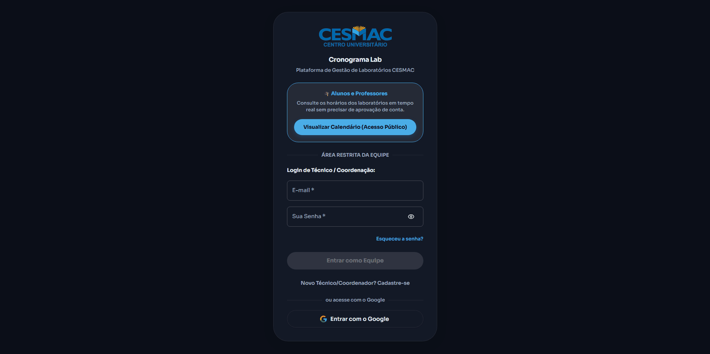
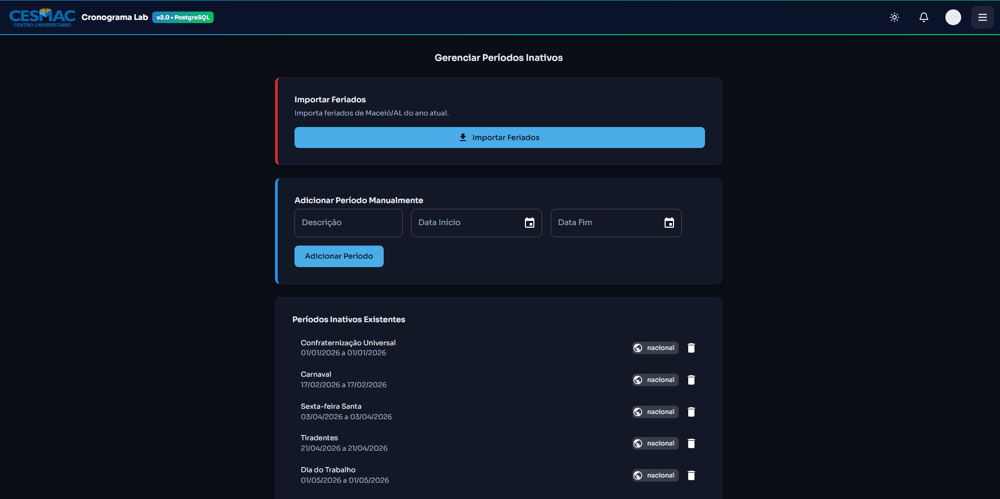
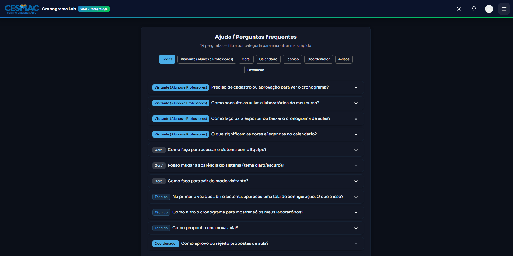
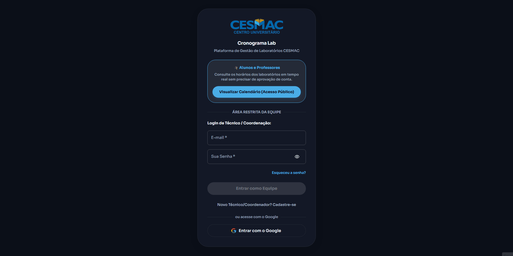
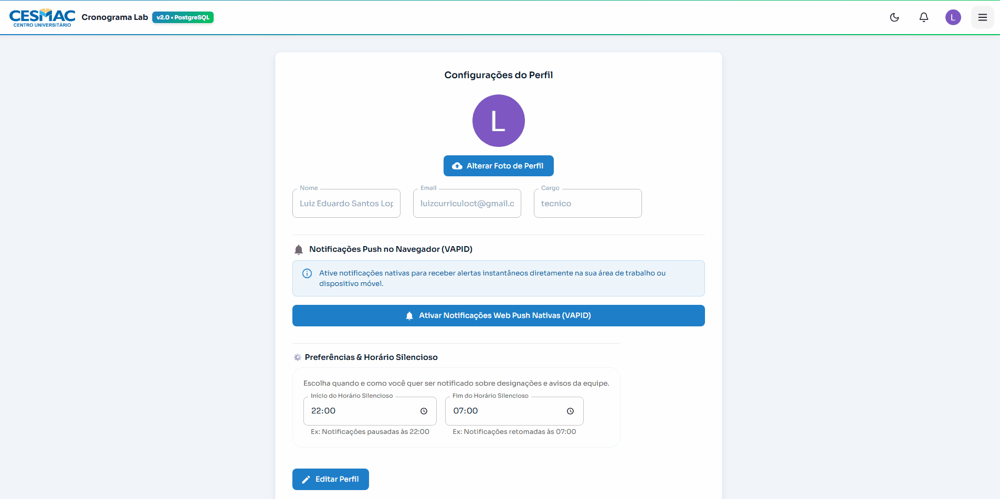
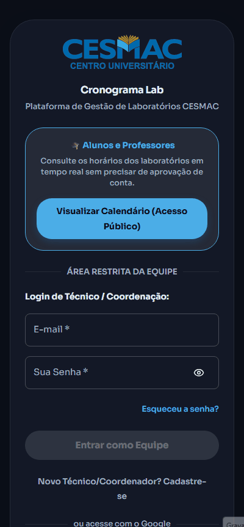
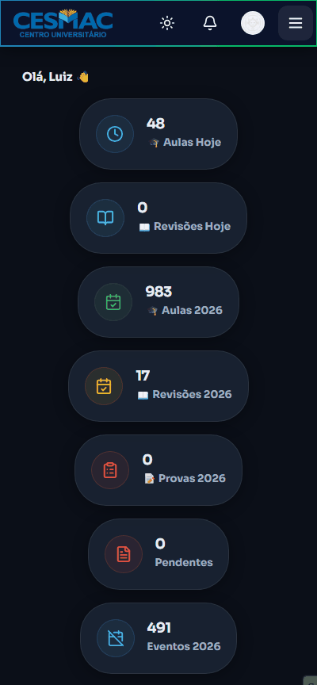

# 🔬 CronoLab — Sistema de Gestão de Cronogramas de Laboratórios

> **Plataforma web proprietária, intuitiva e moderna** desenvolvida para simplificar o agendamento de laboratórios acadêmicos em Universidades e Instituições de Ensino Superior (IES). Conecta alunos, professores, técnicos e coordenadores em um só ambiente organizado.


<p align="center">
  <a href="#-sobre-o-projeto--origem">Sobre & Origem</a> •
  <a href="#-como-funciona-para-cada-perfil">Como Funciona</a> •
  <a href="#-demonstra%C3%A7%C3%A3o-visual--gifs">GIFs & Demonstrações</a> •
  <a href="#-recursos-e-funcionalidades">Recursos</a> •
  <a href="#-tecnologias-usadas">Tecnologias</a> •
  <a href="#-executar-e-configurar-localmente">Executar Localmente</a>
</p>

<p align="center">
  
  
  
  
  
  
</p>

<p align="center">
  <a href="https://cronogramabd.vercel.app"><strong>🌐 Acesse a Aplicação ao Vivo (Demonstração) →</strong></a>
</p>

---

## 💡 Sobre o Projeto & Origem

A ideia do **CronoLab** nasceu diretamente da **vivência prática**. Atuando no dia a dia como **auxiliar de laboratório e apoiando a coordenação acadêmica**, vivenciei de perto os grandes desafios na gestão dos espaços físicos: trocas de mensagens dispersas, papéis perdidos e o retrabalho constante causado por choque de horários entre disciplinas.

Percebendo essa necessidade real, projetei o **CronoLab**: um sistema inteligente, transparente e robusto feito sob medida para facilitar a rotina dos **colegas técnicos**, dar previsibilidade à **coordenação** e garantir acesso rápido para **professores e alunos**.

### O que o CronoLab proporciona:
- 🚫 **Validação Automática contra Conflitos**: Bloqueia no ato qualquer tentativa de agendamento duplicado para a mesma sala e horário.
- 📱 **Acessibilidade Multiplataforma**: Experiência fluida tanto no computador de bancada quanto no smartphone.
- 🔔 **Comunicação Ativa & Notificações**: Alertas no navegador/área de trabalho assim que uma aula é proposta, aprovada ou ajustada.
- 📄 **Integração de Relatórios**: Exportação direta para Excel, PDF e calendários corporativos (Google Agenda, Outlook, Apple Calendar).

---

## 👥 Como Funciona para Cada Perfil?

| Perfil | O que pode fazer no CronoLab? |
| :--- | :--- |
| **🎓 Alunos e Visitantes** | Consultam a grade de aulas de qualquer curso ou laboratório livremente no modo visitante seguro, sem precisar de senha ou cadastro. |
| **🧑‍🔬 Professores e Técnicos** | Agendam aulas práticas, enviam solicitações de revisões/provas, gerenciam laboratórios favoritos e acompanham a liberação de bancadas. |
| **👨‍💼 Coordenadores** | Central unificada para aprovar/rejeitar solicitações em 1 clique, cadastrar avisos, gerenciar manutenções/feriados e emitir relatórios institucionais. |

---

## 🎬 Demonstração Visual & GIFs

---

### 💻 NAVEGADOR DESKTOP (Computador)

#### 1. Modo Visitante (Acesso Público e Consulta de Aulas)
Visualização sem necessidade de login para consulta de turmas e horários:


#### 2. Tela Inicial do Técnico
Painel inicial do técnico para acompanhamento rápido dos laboratórios favoritos:


#### 3. Propor e Agendar Aulas Práticas
Formulário de proposta com seleção de cursos, laboratórios e horários padronizados:


#### 4. Calendário do Próprio Técnico
Visão dedicada do técnico para controle das suas disciplinas e horários:


#### 5. Dashboard do Técnico
Painel operacional para acompanhamento geral das atividades técnicas:


#### 6. Dashboard e Calendário do Coordenador
Visão executiva do coordenador para gestão completa dos laboratórios:


#### 7. Central e Gerenciador de Propostas
Aprovação ou rejeição de agendamentos solicitados pelos professores/técnicos:


#### 8. Cadastro de Feriados e Manutenções Preventivas
Bloqueio de laboratórios durante manutenções ou datas festivas:


#### 9. Relatórios & Download do Cronograma
Exportação personalizada em Excel, PDF e arquivos iCal (.ics):


#### 10. Central de Ajuda & FAQ
Base de conhecimento integrada para sanar dúvidas da equipe:


#### 11. Cadastro de Usuários & Configurações de Perfil
Gerenciamento do perfil de usuário, foto e preferências de horário silencioso:



---

### 📱 NAVEGADOR MOBILE (Dispositivos Móveis / Smartphone)

#### 1. Modo Visitante no Celular
Interface mobile fluida para consulta rápida por alunos e professores:


#### 2. Painel de Coordenadores e Técnicos no Celular
Gestão ágil de aprovações e agendamentos na palma da mão:


---

## 🚀 Recursos e Funcionalidades

- 📅 **Calendário Interativo de Ocupação**: Blocos padronizados de horários (Matutino, Vespertino e Noturno).
- 📝 **Modos de Atividade Distintos**:
  - 🎓 **Aula Normal**: Identificação em azul institucional.
  - 📖 **Revisão / Reforço**: Identificação em roxo.
  - 📝 **Prova / Avaliação**: Identificação em vermelho de alto contraste.
- 🔒 **Modo Visitante Seguro**: Permite que qualquer pessoa consulte os horários sem risco de alterar ou excluir dados.
- 🔔 **Notificações Nativas do Navegador**: Alertas instantâneos de aprovação no computador e celular, imunes a bloqueadores de anúncios.
- 📊 **Importação & Exportação**:
  - Importação de cronogramas em planilhas Excel (`.xlsx`) ou documentos Word (`.docx`).
  - Exportação em **PDF**, **Excel** ou arquivo de calendário **iCal (.ics)**.
- 🤖 **Assistente de Inteligência Artificial**: Análise e diagnóstico inteligente de choques de horário.

---

## 🛠️ Tecnologias Usadas (Para Desenvolvedores)

- **Frontend**: [React 19](https://react.dev/), [Vite 7](https://vitejs.dev/), [Material-UI (MUI v7)](https://mui.com/), [Dayjs](https://day.js.org/)
- **Backend & Banco de Dados**: [Supabase](https://supabase.com/) (PostgreSQL + Auth PKCE Flow + Realtime Subscriptions + Storage)
- **Hospedagem & CDN**: [Vercel](https://vercel.com/)
- **Inteligência Artificial**: LangChain.js & Groq API (`llama-3.3-70b-versatile`)
- **Documentos & Dados**: ExcelJS, SheetJS (`xlsx`), jsPDF, Tesseract.js (OCR)

---

## 💻 Executar e Configurar Localmente

Passos para executar o projeto em ambiente de desenvolvimento local ou homologação:

### 1. Clonar o Repositório
```bash
git clone https://github.com/luizedu0494/cronogramabd.git
cd cronogramabd
```

### 2. Instalar as Dependências
```bash
npm install
```

### 3. Configurar as Variáveis de Ambiente
Crie um arquivo `.env` na raiz do projeto com as credenciais do Supabase:

```env
VITE_SUPABASE_URL=https://seu_projeto.supabase.co
VITE_SUPABASE_ANON_KEY=sua_chave_anonima_supabase
VITE_GROQ_API_KEY=sua_chave_groq_opcional
```

### 4. Iniciar o Servidor de Desenvolvimento
```bash
npm run dev
```
O projeto estará disponível no endereço `http://localhost:5173`.

---

## 🔒 Licença e Direitos Comerciais

Este software é um produto **Proprietário e Comercial**. Todos os direitos reservados ao desenvolvedor.  
Proibida a reprodução, cópia, distribuição ou comercialização não autorizada do código-fonte ou de suas partes. Para licenciamento corporativo ou aquisição de direitos de uso para instituições de ensino, entre em contato.
