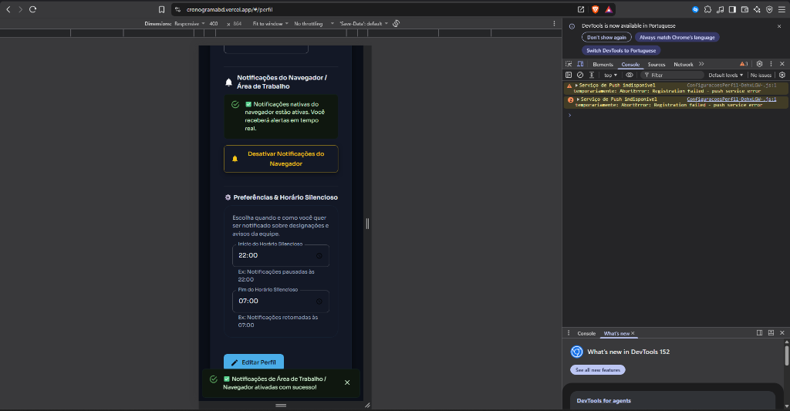
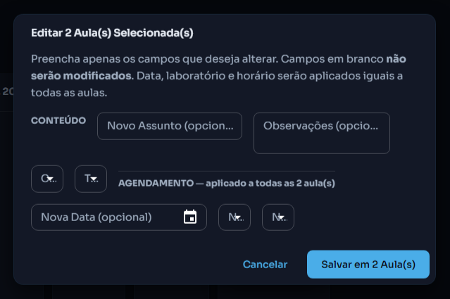

# 🔬 CronoLab — Sistema de Gestão de Cronogramas de Laboratórios

> **Plataforma web moderna, intuitiva e acessível** desenvolvida para simplificar o agendamento de laboratórios acadêmicos em universidades e faculdades. Conecta alunos, professores, técnicos e coordenadores em um só lugar de maneira rápida e organizada.


<p align="center">
  <a href="#-o-que-%C3%A9-o-cronolab-para-leigos">O que é?</a> •
  <a href="#-como-funciona-para-cada-pessoa">Como Funciona</a> •
  <a href="#-demonstra%C3%A7%C3%A3o-visual">Demonstração Visual</a> •
  <a href="#-principais-recursos">Recursos</a> •
  <a href="#-tecnologias-usadas">Tecnologias</a> •
  <a href="#-como-rodar-o-projeto">Como Rodar</a>
</p>

<p align="center">
  
  
  
  
  
</p>

<p align="center">
  <a href="https://cronogramabd.vercel.app"><strong>🌐 Acesse a Aplicação ao Vivo (Demonstração) →</strong></a>
</p>

---

## 💡 O que é o CronoLab? (Para Leigos)

Em faculdades e universidades, conseguir um laboratório para dar aula, fazer provas ou realizar aulas práticas costuma ser confuso: papéis perdidos, trocas de mensagens informais e dois professores tentando usar a mesma sala no mesmo horário.

O **CronoLab** resolve tudo isso! Funciona como uma **agenda digital inteligente**:
- 🚫 **Impede horários duplicados automaticamente**: O sistema não deixa duas pessoas reservarem o mesmo laboratório no mesmo horário.
- 📱 **Funciona no Celular e Computador**: Acesse de qualquer lugar com visualização clara e adaptada.
- 🔔 **Notificações em Tempo Real**: Receba avisos no seu navegador/área de trabalho quando uma aula for aprovada ou alterada.
- 📄 **Exportação Fácil**: Baixe a programação em Excel, PDF ou adicione direto à sua agenda (Google Agenda, Outlook, Apple Calendar).

---

## 👥 Como Funciona para Cada Pessoa?

| Perfil | O que pode fazer no CronoLab? |
| :--- | :--- |
| **🎓 Alunos e Visitantes** | Consultam o horário das aulas de qualquer curso ou laboratório livremente, sem precisar de senha ou cadastro. |
| **🧑‍🔬 Professores e Técnicos** | Enviam propostas de aulas, revisões e provas, escolhem laboratórios favoritos e acompanham suas solicitações. |
| **👨‍💼 Coordenadores** | Aprova ou rejeita propostas em 1 clique, gerencia bloqueios para manutenção/feriados e emite relatórios institucionais. |

---

## 📸 Demonstração Visual

### 1. Painel de Notificações e Configuração de Perfil
Notificações nativas em tempo real no navegador (imunes a bloqueadores de anúncios) e controle personalizado de horário silencioso:



### 2. Agenda de Atividades e Grade Visual
Visualização limpa por dia, semana ou mês, diferenciando Aulas, Revisões e Provas por cores institucionais:



---

## 🚀 Principais Recursos

- 📅 **Calendário Interativo de Ocupação**: Visualização por blocos de horários (Matutino, Vespertino e Noturno).
- 📝 **Tipos de Atividades com Cores Exclusivas**:
  - 🎓 **Aula Normal**: Azul institucional.
  - 📖 **Revisão / Reforço**: Roxo.
  - 📝 **Prova / Avaliação**: Vermelho em destaque.
- 🔒 **Modo Visitante Seguro**: Visitantes visualizam as informações sem permissão de alterar ou excluir dados.
- 📊 **Importação & Exportação**:
  - Importe cronogramas inteiros via planilhas Excel (`.xlsx`) ou documentos (`.docx`).
  - Exporte relatórios organizados em **PDF**, **Excel** ou arquivo de calendário **iCal (.ics)**.
- 🤖 **Assistente de Inteligência Artificial**: Diagnóstico inteligente de choque de turmas e sugestões de otimização de espaço.

---

## 🛠️ Tecnologias Usadas (Para Desenvolvedores)

O projeto foi construído com a stack web moderna focada em desempenho, tipografia ergonômica (Sora & Inter) e acessibilidade:

- **Frontend**: [React 19](https://react.dev/), [Vite 7](https://vitejs.dev/), [Material-UI (MUI v7)](https://mui.com/), [Dayjs](https://day.js.org/)
- **Backend & Banco de Dados**: [Supabase](https://supabase.com/) (PostgreSQL + Auth PKCE Flow + Realtime Subscriptions + Storage)
- **Hospedagem & CDN**: [Vercel](https://vercel.com/)
- **Inteligência Artificial**: LangChain.js & Groq API (`llama-3.3-70b-versatile`)
- **Documentos & Manipulação de Dados**: ExcelJS, SheetJS (`xlsx`), jsPDF, Tesseract.js (OCR)

---

## 💻 Como Rodar o Projeto Localmente

Se você é desenvolvedor e deseja testar ou contribuir com o projeto na sua máquina:

### 1. Clonar o Repositório
```bash
git clone https://github.com/luizedu0494/cronogramabd.git
cd cronogramabd
```

### 2. Instalar as Dependências
```bash
npm install
```

### 3. Configurar as Variáveis de Ambiente
Crie um arquivo `.env` na raiz do projeto com as chaves do seu banco Supabase:

```env
VITE_SUPABASE_URL=https://seu_projeto.supabase.co
VITE_SUPABASE_ANON_KEY=sua_chave_anonima_supabase
VITE_GROQ_API_KEY=sua_chave_groq_opcional
```

### 4. Iniciar o Servidor de Desenvolvimento
```bash
npm run dev
```
O projeto estará rodando no endereço `http://localhost:5173`.

---

## 📄 Licença

Este projeto é de propriedade privada. Todos os direitos reservados.
